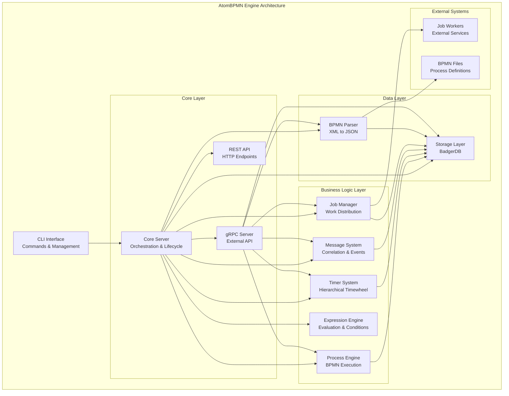

# AtomBPMN Engine 🚀

[](https://www.gnu.org/licenses/agpl-3.0)
[](https://golang.org/)
[](https://zeebe.io/)
[](https://grpc.io/)

**AtomBPMN Engine** is a high-performance, cloud-native BPMN 2.0 process engine written in Go. It provides full compatibility with Zeebe 8.x APIs while offering enhanced performance, autonomous component architecture, and comprehensive process orchestration capabilities.

## ✨ Key Features

- 🔧 **Full BPMN 2.0 Support** - Complete implementation of BPMN elements
- 🌐 **Zeebe 8.x Compatible** - 100% API compatibility with Zeebe ecosystem
- ⚡ **High Performance** - Optimized Go implementation with minimal overhead
- 🔄 **Autonomous Architecture** - Independent, loosely-coupled components
- 🎯 **Advanced Timer System** - Hierarchical timewheel with O(1) operations
- 📬 **Message Correlation** - Sophisticated message routing and buffering
- 🛠️ **Comprehensive CLI** - Full-featured command-line interface
- 🔒 **Persistent State** - 100% durable system with BadgerDB storage
- 📊 **Expression Engine** - Rich expression evaluation capabilities
- 🔌 **Dual APIs** - Both gRPC and REST endpoints

## 🏗️ Architecture Overview

AtomBPMN Engine follows a microservices-inspired architecture with autonomous components communicating through gRPC and JSON protocols.

### Core Components

- **Core Server** - Central orchestration and component lifecycle management
- **Process Engine** - BPMN execution engine with token-based flow control
- **Timer System** - 5-level hierarchical timewheel (seconds to 100+ years)
- **Storage Layer** - BadgerDB-based persistent storage with repositories
- **Message System** - Event correlation, buffering, and subscription management
- **Expression Engine** - FEEL-like expression evaluation
- **Parser** - BPMN XML to JSON transformation
- **CLI Interface** - Comprehensive command-line administration tools

### Architecture Diagram



## 🚀 Quick Start

### Prerequisites

- Go 1.21 or higher
- Git
- Make (optional, for build automation)

### Installation

```bash
# Clone the repository
git clone https://github.com/sembaev-a-a/atom-engine.git
cd atom-engine

# Build the engine
make build

# Or build manually
go build -o build/atomd .
```

### Running AtomBPMN Engine

```bash
# Start the daemon
./build/atomd start

# Check status
./build/atomd status

# View help
./build/atomd help
```

## 📖 Usage Guide

### Basic Workflow

1. **Deploy a BPMN Process**
```bash
./build/atomd bpmn parse my-process.bpmn
```

2. **Start a Process Instance**
```bash
./build/atomd process start MyProcessKey
```

3. **Monitor Execution**
```bash
./build/atomd process list
./build/atomd token trace <instance-id>
```

### CLI Commands Reference

#### Daemon Management
```bash
atomd start              # Start daemon in background
atomd run                # Run daemon in foreground
atomd stop               # Stop daemon
atomd status             # Check daemon status
atomd events             # Show system events
```

#### BPMN Management
```bash
atomd bpmn parse <file.bpmn>        # Parse and deploy BPMN
atomd bpmn list                     # List all processes
atomd bpmn show <process-key>       # Show process details
atomd bpmn delete <process-id>      # Delete process
atomd bpmn stats                    # Show statistics
```

#### Process Management
```bash
atomd process start <process-key>         # Start process instance
atomd process status <instance-id>        # Get instance status
atomd process cancel <instance-id>        # Cancel instance
atomd process list [status] [limit]       # List instances
```

#### Timer Management
```bash
atomd timer add <id> <duration>           # Add timer (PT30S, R5/PT10S)
atomd timer remove <id>                   # Remove timer
atomd timer status <id>                   # Check timer status
atomd timer list [status] [limit]         # List timers
atomd timer stats                         # Timewheel statistics
```

#### Job Management
```bash
atomd job list [type] [worker]            # List jobs
atomd job activate <type> <worker>        # Activate jobs for worker
atomd job complete <job-key>              # Complete job
atomd job fail <job-key> <retries>        # Fail job with retries
```

#### Message Management
```bash
atomd message publish <name> [key]        # Publish message
atomd message list                        # List message results
atomd message subscriptions               # List subscriptions
atomd message buffered                    # List buffered messages
```

#### Storage Management
```bash
atomd storage status                      # Storage status
atomd storage info                        # Storage statistics
```

## 🔧 Configuration

Configuration is managed through `config/config.yaml`:

```yaml
instance_name: "atom-engine-dev"
port: 8080
grpc_port: 9090

database:
  path: "data/"
  
logging:
  level: "INFO"
  file: "logs/app.log"
  max_size: 100
  max_backups: 10
  max_age: 30
```

## 📋 Supported BPMN Elements

### Events
- ✅ **Start Events** - None, Timer, Message, Signal
- ✅ **Intermediate Events** - Timer, Message, Signal (Catch/Throw)
- ✅ **End Events** - None, Message, Signal, Error
- ✅ **Boundary Events** - Timer, Message, Error (Interrupting/Non-interrupting)

### Tasks
- ✅ **Service Tasks** - External job workers
- ✅ **Script Tasks** - Expression evaluation
- ✅ **User Tasks** - Manual task assignment
- ✅ **Send/Receive Tasks** - Message handling

### Gateways
- ✅ **Exclusive Gateway** - XOR conditions
- ✅ **Parallel Gateway** - AND splits/joins
- ✅ **Inclusive Gateway** - OR conditions
- ✅ **Event-based Gateway** - Event-driven routing

### Advanced Features
- ✅ **Call Activities** - Subprocess invocation
- ✅ **Message Correlation** - Cross-process communication
- ✅ **Timer Cycles** - Repeating timers (R/PT format)
- ✅ **Error Handling** - Boundary error events
- ✅ **Collaboration** - Multi-participant processes

## 🎯 Expression Engine

AtomBPMN supports rich expression evaluation:

```bash
# Simple arithmetic
atomd expression eval "x + y" '{"x": 5, "y": 3}'

# Conditional logic
atomd expression eval "user.age >= 18" '{"user": {"age": 25}}'

# String operations
atomd expression eval "upper(user.name)" '{"user": {"name": "john"}}'

# Complex conditions
atomd expression eval "amount > 1000 and status == 'approved'" '{"amount": 1500, "status": "approved"}'
```

## 📊 Performance Features

### Timer System
- **5-level hierarchical timewheel** - Seconds, Minutes, Hours, Days, Years
- **O(1) timer operations** - Add, remove, trigger
- **ISO 8601 duration support** - PT30S, P1D, R5/PT10S formats
- **Persistent timers** - Survive system restarts

### Message Correlation
- **Advanced correlation keys** - Multi-field correlation
- **Message buffering** - Handle out-of-order messages
- **TTL support** - Automatic message cleanup
- **Subscription management** - Dynamic event subscriptions

### Storage Optimization
- **BadgerDB backend** - High-performance embedded database
- **Atomic operations** - ACID compliance
- **Efficient indexing** - Fast lookups and queries
- **Backup support** - Point-in-time recovery

## 🔌 API Compatibility

### Zeebe 8.x Compatible APIs

AtomBPMN Engine provides 100% API compatibility with Zeebe 8.x:

- **Process Deployment** - Deploy BPMN processes
- **Process Instance Management** - Start, cancel, query instances
- **Job Workers** - Activate, complete, fail jobs
- **Message Correlation** - Publish and correlate messages
- **Variable Management** - Get, set process variables

### gRPC Services

```protobuf
// Process Service
service ProcessService {
  rpc StartProcess(StartProcessRequest) returns (StartProcessResponse);
  rpc CancelProcessInstance(CancelProcessInstanceRequest) returns (CancelProcessInstanceResponse);
  rpc ListProcessInstances(ListProcessInstancesRequest) returns (ListProcessInstancesResponse);
}

// Job Service  
service JobService {
  rpc ActivateJobs(ActivateJobsRequest) returns (ActivateJobsResponse);
  rpc CompleteJob(CompleteJobRequest) returns (CompleteJobResponse);
  rpc FailJob(FailJobRequest) returns (FailJobResponse);
}

// Message Service
service MessageService {
  rpc PublishMessage(PublishMessageRequest) returns (PublishMessageResponse);
  rpc ListMessages(ListMessagesRequest) returns (ListMessagesResponse);
}
```

## 🛠️ Development

### Building from Source

```bash
# Full build with proto generation
make build-full

# Fast build (assumes protos exist)
make build

# Generate protobuf files only
make proto

# Clean build artifacts
make clean
```

### Project Structure

```
atom-engine/
├── src/                          # Source code
│   ├── core/                     # Core system components
│   │   ├── config/              # Configuration management
│   │   ├── grpc/                # gRPC services
│   │   ├── logger/              # Logging system
│   │   ├── models/              # Data models
│   │   └── server/              # Server management
│   ├── process/                 # Process engine
│   ├── timewheel/               # Timer system
│   ├── messages/                # Message correlation
│   ├── jobs/                    # Job management
│   ├── storage/                 # Data persistence
│   ├── parser/                  # BPMN parser
│   ├── expression/              # Expression engine
│   └── interfaces/cli/          # CLI interface
├── proto/                       # Protocol buffer definitions
├── config/                      # Configuration files
├── bpmn_test/                   # Test BPMN files
└── build/                       # Build output
```

### Component Architecture Principles

- **Autonomous Components** - Each component operates independently
- **JSON Communication** - Standardized data exchange format
- **SRP Compliance** - Single Responsibility Principle
- **Persistent State** - All components maintain durable state
- **gRPC Services** - Inter-component communication

## 🧪 Testing

```bash
# Run unit tests
go test ./...

# Test specific component
go test ./src/timewheel/...

# Run with coverage
go test -cover ./...

# Integration testing with BPMN files
./build/atomd bpmn parse bpmn_test/service_task_v1.bpmn
./build/atomd process start ProcessKey
```

## 📚 Examples

### Service Task Process

```xml
<?xml version="1.0" encoding="UTF-8"?>
<bpmn:definitions xmlns:bpmn="http://www.omg.org/spec/BPMN/20100524/MODEL">
  <bpmn:process id="ServiceTaskProcess" isExecutable="true">
    <bpmn:startEvent id="StartEvent" />
    <bpmn:serviceTask id="ProcessData" name="Process Data">
      <bpmn:extensionElements>
        <zeebe:taskDefinition type="data-processor" retries="3" />
      </bpmn:extensionElements>
    </bpmn:serviceTask>
    <bpmn:endEvent id="EndEvent" />
    
    <bpmn:sequenceFlow sourceRef="StartEvent" targetRef="ProcessData" />
    <bpmn:sequenceFlow sourceRef="ProcessData" targetRef="EndEvent" />
  </bpmn:process>
</bpmn:definitions>
```

### Timer Process

```xml
<bpmn:process id="TimerProcess" isExecutable="true">
  <bpmn:startEvent id="StartEvent" />
  <bpmn:intermediateCatchEvent id="WaitTimer">
    <bpmn:timerEventDefinition>
      <bpmn:timeDuration>PT30S</bpmn:timeDuration>
    </bpmn:timerEventDefinition>
  </bpmn:intermediateCatchEvent>
  <bpmn:endEvent id="EndEvent" />
  
  <bpmn:sequenceFlow sourceRef="StartEvent" targetRef="WaitTimer" />
  <bpmn:sequenceFlow sourceRef="WaitTimer" targetRef="EndEvent" />
</bpmn:process>
```

## 🌐 Technology Stack

- **Go 1.21+** - Core runtime
- **BadgerDB** - Embedded database
- **gRPC** - Inter-service communication
- **Protocol Buffers** - Data serialization
- **Mermaid** - Architecture diagrams
- **ISO 8601** - Duration and date formatting

## 📄 License

This project is dual-licensed:

- **Open Source**: AGPL-3.0 License
- **Commercial**: AtomBPMN Commercial License

For commercial licensing, please contact: Matreska Market LLC

## 🤝 Contributing

1. Fork the repository
2. Create your feature branch (`git checkout -b feature/amazing-feature`)
3. Commit your changes (`git commit -m 'Add amazing feature'`)
4. Push to the branch (`git push origin feature/amazing-feature`)
5. Open a Pull Request

## 📞 Support

- **Documentation**: [GitHub Wiki](https://github.com/sembaev-a-a/atom-engine/wiki)
- **Issues**: [GitHub Issues](https://github.com/sembaev-a-a/atom-engine/issues)
- **Discussions**: [GitHub Discussions](https://github.com/sembaev-a-a/atom-engine/discussions)

---

## 🇷🇺 Описание на русском языке

**AtomBPMN Engine** - это высокопроизводительный, облачно-ориентированный движок BPMN 2.0 процессов, написанный на Go. Обеспечивает полную совместимость с API Zeebe 8.x, предлагая при этом улучшенную производительность, автономную архитектуру компонентов и всеобъемлющие возможности оркестрации процессов.

### Ключевые особенности

- 🔧 **Полная поддержка BPMN 2.0** - Полная реализация элементов BPMN
- 🌐 **Совместимость с Zeebe 8.x** - 100% совместимость API с экосистемой Zeebe
- ⚡ **Высокая производительность** - Оптимизированная реализация на Go с минимальными накладными расходами
- 🔄 **Автономная архитектура** - Независимые, слабо связанные компоненты
- 🎯 **Продвинутая система таймеров** - Иерархическое временное колесо с операциями O(1)
- 📬 **Корреляция сообщений** - Сложная маршрутизация и буферизация сообщений
- 🛠️ **Полнофункциональный CLI** - Полнофункциональный интерфейс командной строки
- 🔒 **Постоянное состояние** - 100% надежная система с хранилищем BadgerDB
- 📊 **Движок выражений** - Богатые возможности оценки выражений
- 🔌 **Двойные API** - Конечные точки gRPC и REST

### Быстрый старт

```bash
# Клонирование репозитория
git clone https://github.com/sembaev-a-a/atom-engine.git
cd atom-engine

# Сборка движка
make build

# Запуск демона
./build/atomd start

# Проверка статуса
./build/atomd status
```

### Базовый рабочий процесс

```bash
# Развертывание BPMN процесса
./build/atomd bpmn parse my-process.bpmn

# Запуск экземпляра процесса
./build/atomd process start MyProcessKey

# Мониторинг выполнения
./build/atomd process list
./build/atomd token trace <instance-id>
```

### Поддерживаемые элементы BPMN

- **События**: Start, Intermediate, End (Timer, Message, Signal, Error)
- **Задачи**: Service, Script, User, Send/Receive
- **Шлюзы**: Exclusive, Parallel, Inclusive, Event-based
- **Расширенные функции**: Call Activities, корреляция сообщений, циклы таймеров

### Технологический стек

- **Go 1.21+** - Основная среда выполнения
- **BadgerDB** - Встроенная база данных
- **gRPC** - Межсервисная связь
- **Protocol Buffers** - Сериализация данных

### Лицензия

Проект имеет двойную лицензию:
- **Открытый исходный код**: Лицензия AGPL-3.0
- **Коммерческая**: Коммерческая лицензия AtomBPMN

---

Copyright (c) 2025 Matreska Market LLC (ООО «Matreska Market»). All rights reserved.
