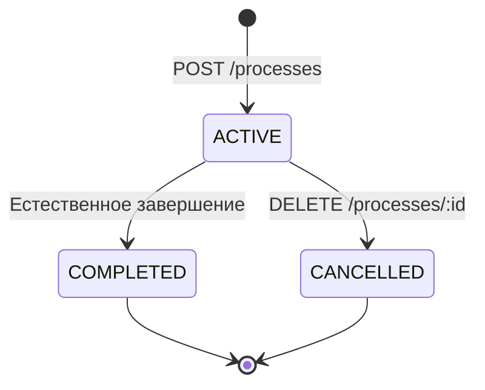

# Process Engine Endpoints

Управление экземплярами BPMN процессов в Atom Engine.

## Обзор

Process Engine предоставляет полный набор операций для управления жизненным циклом BPMN процессов: от запуска до завершения или отмены.

## Основные операции

### 📤 Запуск процессов
- [POST /api/v1/processes](start-process.md) - Запуск нового экземпляра процесса
- [POST /api/v1/processes/typed](start-process-typed.md) - Запуск с расширенной типизацией

### 📋 Просмотр процессов
- [GET /api/v1/processes](list-processes.md) - Список экземпляров с фильтрацией
- [GET /api/v1/processes/typed](list-processes-typed.md) - Типизированный список
- [GET /api/v1/processes/stats](get-process-stats.md) - Статистика процессов

### 🔍 Детали процесса
- [GET /api/v1/processes/:id](get-process-status.md) - Базовый статус процесса
- [GET /api/v1/processes/:id/info](get-process-info.md) - Детальная информация
- [GET /api/v1/processes/:id/typed](get-process-status-typed.md) - Типизированный статус

### 🎯 Токены и трассировка
- [GET /api/v1/processes/:id/tokens](get-process-tokens.md) - Токены процесса
- [GET /api/v1/processes/:id/tokens/trace](get-token-trace.md) - Трассировка выполнения
- [GET /api/v1/processes/:id/tokens/typed](get-process-tokens-typed.md) - Типизированные токены
- [GET /api/v1/processes/:id/trace/typed](trace-process-execution-typed.md) - Расширенная трассировка

### ❌ Управление жизненным циклом
- [DELETE /api/v1/processes/:id](cancel-process.md) - Отмена процесса
- [DELETE /api/v1/processes/:id/typed](cancel-process-typed.md) - Типизированная отмена

## Статусы процессов

| Статус | Описание |
|--------|----------|
| `ACTIVE` | Процесс выполняется |
| `COMPLETED` | Процесс успешно завершен |
| `CANCELLED` | Процесс отменен |

## Жизненный цикл процесса



## Быстрый старт

### 1. Запуск процесса
```bash
curl -X POST /api/v1/processes \
  -H "Content-Type: application/json" \
  -H "X-API-Key: your-api-key" \
  -d '{
    "process_id": "order-processing",
    "variables": {
      "orderId": "ORD-12345",
      "amount": 299.99
    }
  }'
```

### 2. Проверка статуса
```bash
curl -H "X-API-Key: your-api-key" \
  /api/v1/processes/srv1-aB3dEf9hK2mN5pQ8uV
```

### 3. Мониторинг выполнения
```bash
curl -H "X-API-Key: your-api-key" \
  /api/v1/processes/srv1-aB3dEf9hK2mN5pQ8uV/tokens/trace
```

### 4. Отмена при необходимости
```bash
curl -X DELETE \
  -H "X-API-Key: your-api-key" \
  "/api/v1/processes/srv1-aB3dEf9hK2mN5pQ8uV?reason=Customer%20cancellation"
```

## Различия между базовыми и typed endpoints

### Базовые endpoints
- Простая JSON структура
- Совместимость с Zeebe 8
- Базовая функциональность

### Typed endpoints  
- Расширенная типизация данных
- Дополнительные метаданные
- Лучшая интеграция с TypeScript/строго типизированными языками
- Расширенная диагностическая информация

## Фильтрация и поиск

### По статусу
```bash
GET /api/v1/processes?status=ACTIVE
```

### По типу процесса
```bash
GET /api/v1/processes?process_id=order-processing
```

### По времени запуска
```bash
GET /api/v1/processes?started_after=2025-01-01T00:00:00Z
```

### Комбинированные фильтры
```bash
GET /api/v1/processes?status=ACTIVE&process_id=order-processing&page=2&page_size=50
```

## Мониторинг и статистика

### Общая статистика
```bash
GET /api/v1/processes/stats
```

### Активные процессы
```bash
GET /api/v1/processes?status=ACTIVE&sort_by=started_at&sort_order=DESC
```

### Проблемные процессы
```bash
GET /api/v1/processes?status=ACTIVE&started_before=2025-01-10T00:00:00Z
```

## Паттерны использования

### 🔄 Массовая обработка
```javascript
// Запуск множественных процессов
const orders = await getNewOrders();
const processes = await Promise.all(
  orders.map(order => startProcess({
    process_id: 'order-processing',
    variables: { order }
  }))
);
```

### 📊 Мониторинг дашборд
```javascript
// Получение данных для дашборда
const [activeProcesses, stats] = await Promise.all([
  fetch('/api/v1/processes?status=ACTIVE'),
  fetch('/api/v1/processes/stats')
]);
```

### 🔍 Отладка процесса
```javascript
// Детальная диагностика
const processInfo = await fetch(`/api/v1/processes/${instanceId}/info`);
const trace = await fetch(`/api/v1/processes/${instanceId}/tokens/trace`);
```

## Ограничения

### Производительность
- **Максимальный page_size**: 100
- **Максимальные переменные**: 5MB на процесс
- **Время ответа**: < 200ms для простых запросов

### Хранение
- **История процессов**: Хранится 90 дней
- **Переменные**: Сжимаются при превышении 1MB
- **Трассировка**: Детальная информация 30 дней

## Связанные компоненты

- [BPMN Parser](../bpmn/README.md) - Управление определениями процессов
- [Job Management](../jobs/README.md) - Обработка service tasks
- [Message System](../messages/README.md) - Корреляция сообщений
- [Timer Management](../timers/README.md) - Временные события
- [Incident Management](../incidents/README.md) - Обработка ошибок

---

**Количество endpoints**: 14  
**Типы операций**: CRUD + мониторинг  
**Требуемые разрешения**: `process`
