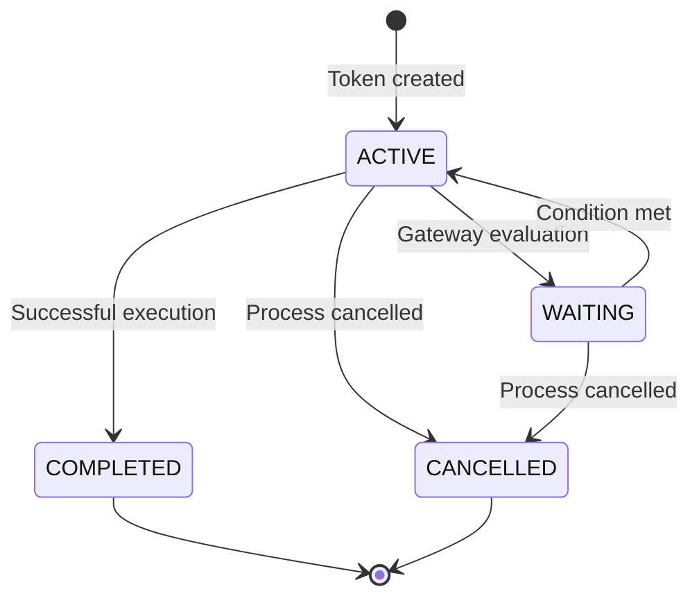

# GET /api/v1/processes/:id/tokens

## Описание
Получение информации о токенах конкретного экземпляра процесса. Токены представляют состояние выполнения в различных точках процесса.

## URL
```
GET /api/v1/processes/{instance_id}/tokens
```

## Авторизация
✅ **Требуется API ключ** с разрешением `process`

## Параметры пути
- `instance_id` (string): ID экземпляра процесса

## Параметры запроса (Query Parameters)
- `state` (string): Фильтр по состоянию токенов (`ACTIVE`, `COMPLETED`, `CANCELLED`)
- `element_type` (string): Фильтр по типу элемента (`serviceTask`, `userTask`, `gateway`, etc.)
- `include_completed` (boolean): Включить завершенные токены (по умолчанию: `true`)

## Примеры запросов

### Все токены
```bash
curl -X GET "http://localhost:27555/api/v1/processes/srv1-aB3dEf9hK2mN5pQ8uV/tokens" \
  -H "X-API-Key: your-api-key-here"
```

### Только активные токены
```bash
curl -X GET "http://localhost:27555/api/v1/processes/srv1-aB3dEf9hK2mN5pQ8uV/tokens?state=ACTIVE" \
  -H "X-API-Key: your-api-key-here"
```

### Токены service tasks
```bash
curl -X GET "http://localhost:27555/api/v1/processes/srv1-aB3dEf9hK2mN5pQ8uV/tokens?element_type=serviceTask" \
  -H "X-API-Key: your-api-key-here"
```

### JavaScript
```javascript
const instanceId = 'srv1-aB3dEf9hK2mN5pQ8uV';
const response = await fetch(`/api/v1/processes/${instanceId}/tokens?state=ACTIVE`, {
  headers: {
    'X-API-Key': 'your-api-key-here'
  }
});

const tokens = await response.json();
```

## Ответы

### 200 OK - Токены получены
```json
{
  "success": true,
  "data": {
    "instance_id": "srv1-aB3dEf9hK2mN5pQ8uV",
    "process_id": "order-processing",
    "tokens": [
      {
        "token_id": "srv1-token-aB3dEf9hK2mN",
        "element_id": "process-payment",
        "element_type": "serviceTask",
        "element_name": "Process Payment",
        "state": "ACTIVE",
        "created_at": "2025-01-11T10:31:30.789Z",
        "updated_at": "2025-01-11T10:31:30.789Z",
        "completed_at": null,
        "cancelled_at": null,
        "variables": {
          "orderId": "ORD-12345",
          "amount": 299.99,
          "paymentMethod": "credit"
        },
        "execution_context": {
          "job_key": "srv1-job-xyz789",
          "worker_id": "payment-worker-02",
          "retries_left": 3,
          "timeout_at": "2025-01-11T10:33:30.789Z"
        },
        "parent_token_id": "srv1-token-parent123",
        "child_tokens": [],
        "flow_history": [
          {
            "from_element": "payment-gateway",
            "via_flow": "flow_3_credit",
            "timestamp": "2025-01-11T10:31:30.789Z"
          }
        ]
      },
      {
        "token_id": "srv1-token-cD4eF8gH1jK3",
        "element_id": "validate-order",
        "element_type": "serviceTask",
        "element_name": "Validate Order",
        "state": "COMPLETED",
        "created_at": "2025-01-11T10:30:15.234Z",
        "updated_at": "2025-01-11T10:30:45.123Z",
        "completed_at": "2025-01-11T10:30:45.123Z",
        "cancelled_at": null,
        "variables": {
          "orderId": "ORD-12345",
          "validationResult": {
            "isValid": true,
            "validatedAt": "2025-01-11T10:30:45.123Z"
          }
        },
        "execution_context": {
          "job_key": "srv1-job-abc123",
          "worker_id": "validation-worker-01",
          "retries_used": 0,
          "duration_ms": 29889
        },
        "parent_token_id": null,
        "child_tokens": ["srv1-token-aB3dEf9hK2mN"],
        "flow_history": [
          {
            "from_element": "start_order",
            "via_flow": "flow_1",
            "timestamp": "2025-01-11T10:30:15.234Z"
          }
        ]
      },
      {
        "token_id": "srv1-token-eF5gH9iJ2kL4",
        "element_id": "payment-gateway",
        "element_type": "exclusiveGateway",
        "element_name": "Payment Method?",
        "state": "COMPLETED",
        "created_at": "2025-01-11T10:31:25.678Z",
        "updated_at": "2025-01-11T10:31:30.789Z",
        "completed_at": "2025-01-11T10:31:30.789Z",
        "cancelled_at": null,
        "variables": {
          "paymentMethod": "credit"
        },
        "execution_context": {
          "gateway_decision": {
            "condition_evaluated": "paymentMethod = 'credit'",
            "selected_flow": "flow_3_credit",
            "evaluation_time_ms": 5
          }
        },
        "parent_token_id": "srv1-token-cD4eF8gH1jK3",
        "child_tokens": ["srv1-token-aB3dEf9hK2mN"],
        "flow_history": [
          {
            "from_element": "validate-order",
            "via_flow": "flow_2",
            "timestamp": "2025-01-11T10:31:25.678Z"
          }
        ]
      }
    ],
    "summary": {
      "total_tokens": 3,
      "active_tokens": 1,
      "completed_tokens": 2,
      "cancelled_tokens": 0,
      "token_states": {
        "ACTIVE": 1,
        "COMPLETED": 2,
        "CANCELLED": 0
      },
      "element_types": {
        "serviceTask": 2,
        "exclusiveGateway": 1,
        "startEvent": 0,
        "endEvent": 0
      }
    }
  },
  "request_id": "req_1641998402200"
}
```

## Поля токена

### Basic Information
- `token_id` (string): Уникальный ID токена
- `element_id` (string): ID элемента BPMN
- `element_type` (string): Тип элемента
- `element_name` (string): Название элемента
- `state` (string): Состояние токена

### Timing Information
- `created_at` (string): Время создания токена
- `updated_at` (string): Время последнего обновления
- `completed_at` (string, nullable): Время завершения
- `cancelled_at` (string, nullable): Время отмены

### Execution Context
- `variables` (object): Переменные доступные токену
- `execution_context` (object): Контекст выполнения
- Для активных токенов: job_key, worker_id, timeout
- Для завершенных: retries_used, duration_ms

### Token Relationships
- `parent_token_id` (string, nullable): ID родительского токена
- `child_tokens` (array): ID дочерних токенов
- `flow_history` (array): История движения по потокам

## Состояния токенов

### Возможные состояния
- `ACTIVE` - Токен активен и выполняется
- `COMPLETED` - Токен успешно завершен
- `CANCELLED` - Токен отменен
- `WAITING` - Токен ожидает (например, на gateway)
- `SUSPENDED` - Токен приостановлен

### Жизненный цикл токена


## Использование

### Token Flow Analysis
```javascript
async function analyzeTokenFlow(instanceId) {
  const response = await fetch(`/api/v1/processes/${instanceId}/tokens`);
  const data = await response.json();
  
  const tokens = data.data.tokens;
  
  // Построение дерева токенов
  const tokenTree = buildTokenTree(tokens);
  
  // Анализ текущего состояния
  const analysis = {
    activeTokens: tokens.filter(t => t.state === 'ACTIVE'),
    completedPath: traceCompletedPath(tokens),
    currentBottlenecks: findBottlenecks(tokens),
    parallelExecution: findParallelTokens(tokens)
  };
  
  return { tokenTree, analysis };
}

function buildTokenTree(tokens) {
  const tokenMap = new Map(tokens.map(t => [t.token_id, t]));
  const tree = [];
  
  tokens.forEach(token => {
    if (!token.parent_token_id) {
      tree.push(buildTokenBranch(token, tokenMap));
    }
  });
  
  return tree;
}

function buildTokenBranch(token, tokenMap) {
  return {
    ...token,
    children: token.child_tokens.map(childId => 
      buildTokenBranch(tokenMap.get(childId), tokenMap)
    )
  };
}

function traceCompletedPath(tokens) {
  return tokens
    .filter(t => t.state === 'COMPLETED')
    .sort((a, b) => new Date(a.completed_at) - new Date(b.completed_at))
    .map(t => ({
      element: t.element_name,
      completedAt: t.completed_at,
      duration: t.execution_context.duration_ms
    }));
}
```

### Performance Analysis
```javascript
async function analyzeTokenPerformance(instanceId) {
  const response = await fetch(`/api/v1/processes/${instanceId}/tokens?include_completed=true`);
  const data = await response.json();
  
  const completedTokens = data.data.tokens.filter(t => t.state === 'COMPLETED');
  
  const performance = {
    totalTokens: data.data.summary.total_tokens,
    avgExecutionTime: 0,
    fastestToken: null,
    slowestToken: null,
    retryAnalysis: {},
    typePerformance: {}
  };
  
  // Анализ времени выполнения
  const durations = completedTokens
    .filter(t => t.execution_context.duration_ms)
    .map(t => t.execution_context.duration_ms);
  
  if (durations.length > 0) {
    performance.avgExecutionTime = durations.reduce((sum, d) => sum + d, 0) / durations.length;
    performance.fastestToken = completedTokens.find(t => 
      t.execution_context.duration_ms === Math.min(...durations)
    );
    performance.slowestToken = completedTokens.find(t => 
      t.execution_context.duration_ms === Math.max(...durations)
    );
  }
  
  // Анализ повторов
  performance.retryAnalysis = completedTokens.reduce((acc, token) => {
    const retries = token.execution_context.retries_used || 0;
    acc[retries] = (acc[retries] || 0) + 1;
    return acc;
  }, {});
  
  // Анализ по типам элементов
  performance.typePerformance = data.data.summary.element_types;
  
  return performance;
}
```

### Real-time Token Monitoring
```javascript
class TokenMonitor {
  constructor(instanceId) {
    this.instanceId = instanceId;
    this.lastUpdate = null;
    this.callbacks = new Map();
  }
  
  async startMonitoring(interval = 5000) {
    const monitor = async () => {
      try {
        const response = await fetch(`/api/v1/processes/${this.instanceId}/tokens?state=ACTIVE`);
        const data = await response.json();
        
        const activeTokens = data.data.tokens;
        
        // Проверяем изменения
        if (this.hasChanges(activeTokens)) {
          this.notifyCallbacks('tokens_updated', activeTokens);
          this.lastUpdate = Date.now();
        }
        
        // Проверяем таймауты
        const timeoutTokens = this.checkTimeouts(activeTokens);
        if (timeoutTokens.length > 0) {
          this.notifyCallbacks('tokens_timeout', timeoutTokens);
        }
        
      } catch (error) {
        this.notifyCallbacks('error', error);
      }
      
      setTimeout(monitor, interval);
    };
    
    monitor();
  }
  
  onTokensUpdated(callback) {
    this.callbacks.set('tokens_updated', callback);
  }
  
  onTokensTimeout(callback) {
    this.callbacks.set('tokens_timeout', callback);
  }
  
  onError(callback) {
    this.callbacks.set('error', callback);
  }
  
  hasChanges(currentTokens) {
    // Логика сравнения с предыдущим состоянием
    return true; // Упрощенная версия
  }
  
  checkTimeouts(tokens) {
    const now = Date.now();
    return tokens.filter(token => {
      if (token.execution_context.timeout_at) {
        const timeoutAt = new Date(token.execution_context.timeout_at).getTime();
        return timeoutAt < now;
      }
      return false;
    });
  }
  
  notifyCallbacks(event, data) {
    const callback = this.callbacks.get(event);
    if (callback) {
      callback(data);
    }
  }
}

// Использование
const monitor = new TokenMonitor('srv1-aB3dEf9hK2mN5pQ8uV');

monitor.onTokensUpdated(tokens => {
  console.log('Active tokens updated:', tokens.length);
});

monitor.onTokensTimeout(tokens => {
  console.warn('Tokens timeout detected:', tokens.map(t => t.element_name));
});

monitor.startMonitoring(3000); // Проверка каждые 3 секунды
```

### Token Debugging
```javascript
async function debugTokenIssues(instanceId) {
  const response = await fetch(`/api/v1/processes/${instanceId}/tokens`);
  const data = await response.json();
  
  const tokens = data.data.tokens;
  const issues = [];
  
  // Поиск проблем
  
  // 1. Долго активные токены
  const longRunningTokens = tokens.filter(token => {
    if (token.state === 'ACTIVE') {
      const runningTime = Date.now() - new Date(token.created_at).getTime();
      return runningTime > 600000; // > 10 минут
    }
    return false;
  });
  
  if (longRunningTokens.length > 0) {
    issues.push({
      type: 'LONG_RUNNING_TOKENS',
      severity: 'HIGH',
      count: longRunningTokens.length,
      tokens: longRunningTokens.map(t => ({
        id: t.token_id,
        element: t.element_name,
        runningTime: Math.round((Date.now() - new Date(t.created_at).getTime()) / 60000)
      }))
    });
  }
  
  // 2. Токены с высоким количеством повторов
  const highRetryTokens = tokens.filter(token => {
    return token.execution_context.retries_used > 2;
  });
  
  if (highRetryTokens.length > 0) {
    issues.push({
      type: 'HIGH_RETRY_TOKENS',
      severity: 'MEDIUM',
      count: highRetryTokens.length,
      tokens: highRetryTokens.map(t => ({
        id: t.token_id,
        element: t.element_name,
        retries: t.execution_context.retries_used
      }))
    });
  }
  
  // 3. Зависшие токены в gateway
  const stuckGatewayTokens = tokens.filter(token => {
    return token.element_type.includes('Gateway') && 
           token.state === 'WAITING' &&
           Date.now() - new Date(token.created_at).getTime() > 300000; // > 5 минут
  });
  
  if (stuckGatewayTokens.length > 0) {
    issues.push({
      type: 'STUCK_GATEWAY_TOKENS',
      severity: 'HIGH',
      count: stuckGatewayTokens.length,
      tokens: stuckGatewayTokens.map(t => ({
        id: t.token_id,
        element: t.element_name,
        waitingTime: Math.round((Date.now() - new Date(t.created_at).getTime()) / 60000)
      }))
    });
  }
  
  return {
    issues,
    summary: {
      totalIssues: issues.length,
      severity: issues.some(i => i.severity === 'HIGH') ? 'HIGH' : 
                issues.some(i => i.severity === 'MEDIUM') ? 'MEDIUM' : 'LOW'
    }
  };
}
```

## Связанные endpoints
- [`GET /api/v1/processes/:id/tokens/trace`](./get-token-trace.md) - Трассировка выполнения токенов
- [`GET /api/v1/processes/:id`](./get-process-status.md) - Статус процесса
- [`GET /api/v1/tokens/:id`](../tokens/get-token-status.md) - Детали конкретного токена
